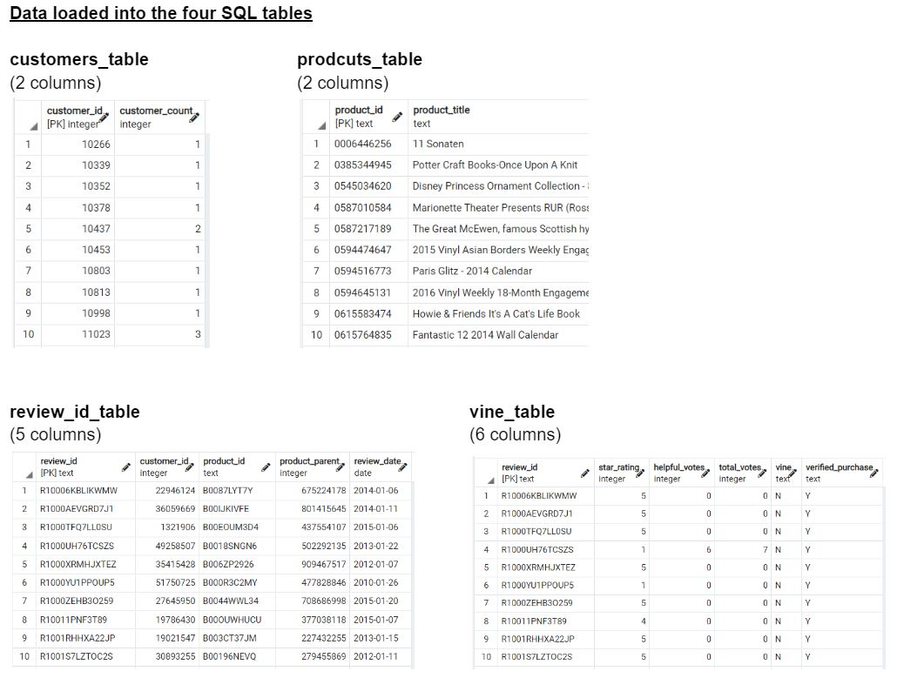

# Amazon Vine Analysis

## Overview:
We will analyze Amazon reviews and determine if Vine reviews (paid) exhibit favorable bias compared to unpaid reviews.

We first perform ETL on the furniture review dataset from the [Amazon Review datasets](https://s3.amazonaws.com/amazon-reviews-pds/tsv/index.txt) and load the data into four SQL tables
 
*see detail code and outputs in the [Amazon_Reviews_ETL file](Amazon_Reviews_ETL.ipynb)*

## Results:
In our furniture review dataset, we find:

* 136 Vine reviews and 18,019 non-paid reviews.  

* Among the Vine reviews, there are 74 5-star reviews or 54% of the Vine reviews.

* Among non-paid reviews, there are 8,482 5-star reviews, or 47% of the non-paid reviews.

*see detail code and outputs in the [Vine_Reveiw_Analysis file](Vine_review_Analysis.ipynb)*

## Summary:
Based on the results, we believe there is a positive bias for reviews in the Vine program since the percentage of 5-star reviews is meaningfully higher among the paid Vine reviews (54%) than the unpaid reviews (47%).

To further support this conclusion, we can see if the paid Vine program has a meaningfully lower percentage of 1-star reviews compared to unpaid reviews.
